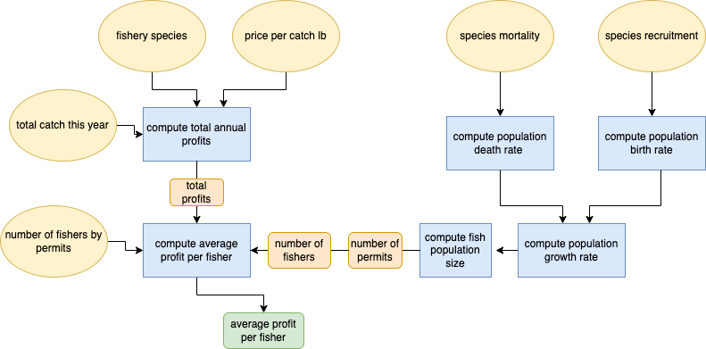

```{r setup, include=TRUE, warning = FALSE, message = FALSE}
knitr::opts_chunk$set(echo = TRUE)

library(here)
```
The purpose of our program is to calculate profits per fisher, given the population size, price per pound, and the total annual catch. 

The first part of the model is used to calculate the population size to determine the number of permits. Parameters include:

- species mortality
- species recruitment

The second part of the model computes the total annual profits to then calculate fisher profits. Inputs include:

- fishery species
- price per catch lb
- total catch this year


Below is a flow chart of our program.



